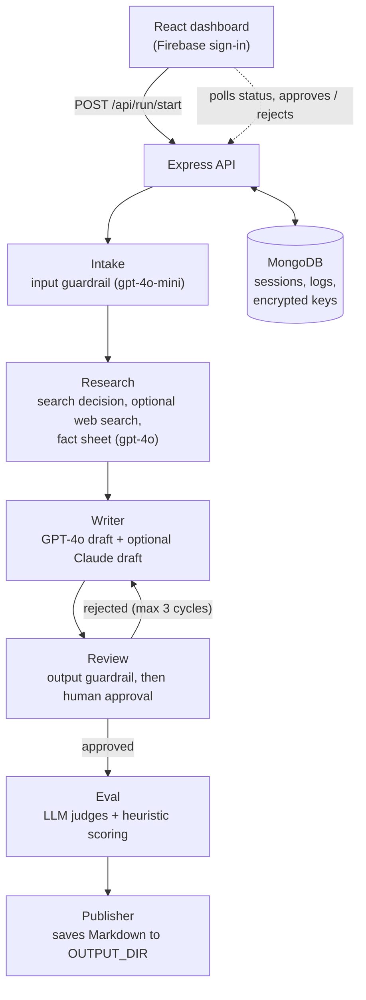

# EasyDraft


[](LICENSE)
[](https://riverborn.com)

**EasyDraft is a self-hosted, multi-agent writing pipeline that turns a short
brief into a researched social post, blog post or email, with a human
approving every draft before it is saved.**

You fill in a brief (topic, tone, audience, channel and an optional angle) in
the web dashboard. A chain of agents checks the brief, decides whether web
research is needed, writes a GPT-4o draft and (if you add an Anthropic key) a
Claude draft side by side, screens the draft for invented statistics and
quotes, and then waits for you to approve, edit or reject it. Approved drafts
are scored and saved as Markdown files. The backend is Node.js and Express
with MongoDB; the frontend is React and Vite; sign-in is Firebase Auth.

> [!NOTE]
> **Built by [Riverborn Limited](https://riverborn.com)**, an AI solutions
> company from Dhaka, Bangladesh. We build agentic AI, generative AI and
> conversational AI (voice, chat and RAG). If you need help building a
> multi-agent workflow or an AI product,
> **[book a call](https://riverborn.com/#book)** or email
> **[hello@riverborn.com](mailto:hello@riverborn.com)**.

## Table of contents

- [Features](#features)
- [How it works](#how-it-works)
- [Tech stack](#tech-stack)
- [Quick start](#quick-start)
  - [Prerequisites](#prerequisites)
  - [Install](#install)
  - [Environment variables](#environment-variables)
  - [Run](#run)
- [Configuration](#configuration)
- [Project layout](#project-layout)
- [Limitations and known issues](#limitations-and-known-issues)
- [About Riverborn](#about-riverborn)
- [License](#license)

---

## Features

- **Agent pipeline:** Intake, Research, Writer, Review, Eval and Publisher
  steps run in order for each brief, with a Writer and Review retry loop
  (up to 3 cycles before the run is marked as escalated).
- **Five channels:** LinkedIn, Facebook, blog, X thread and email, with six
  tone presets (professional, casual, thought-leader, inspirational,
  educational, witty).
- **Input guardrail:** `gpt-4o-mini` checks each brief for harmful,
  explicit, off-topic or spam requests before any drafting starts.
- **Search only when needed:** `gpt-4o-mini` decides whether the topic needs
  fresh facts. If it does, a search agent built with the OpenAI Agents SDK
  `webSearchTool()` gathers facts and sources; `gpt-4o` then turns everything
  into a structured fact sheet.
- **Two drafts side by side:** `gpt-4o` writes one draft. If the user has
  saved an Anthropic key, Claude (`claude-sonnet-5`, via Anthropic's
  OpenAI-compatible endpoint) writes a second one in parallel. Without that
  key, only the GPT-4o draft is produced.
- **Output guardrail:** `gpt-4o-mini` checks the draft against the fact sheet
  for invented statistics, fabricated quotes and factual contradictions.
  High-severity findings send the draft back to the Writer automatically.
- **Human in the loop:** approve, edit or reject (with feedback) from the
  **Runs** page. Rejections go back to the Writer with your notes. A
  terminal review mode is also available (`HITL_MODE=terminal`).
- **Scoring and leaderboard:** each approved run gets scores for accuracy,
  tone match, format and hook strength, and the **Eval** page tracks which
  model's draft you picked. See [Limitations](#limitations-and-known-issues)
  for how these scores are calculated.
- **Trace logs:** a per-run activity log of every agent step, shown on the
  **Trace Logs** page.
- **Per-user API keys, encrypted at rest:** each user enters their own OpenAI
  key (required) and Anthropic key (optional) in the browser. The backend
  stores them in MongoDB encrypted with AES-256-GCM, using a server-only
  `KEY_ENCRYPTION_SECRET`. The UI only ever shows a short preview.
- **Accounts:** Google sign-in through Firebase Auth. Every run is scoped to
  the signed-in user.
- **Secret-scanning hygiene:** a Gitleaks GitHub Actions workflow and an
  optional local pre-commit hook that blocks OpenAI/Anthropic keys and
  private keys.

## How it works



1. The frontend sends the brief with the user's Firebase ID token in the
   `X-Firebase-Auth` header. The backend verifies it with Firebase Admin.
2. The backend loads the user's saved, encrypted API keys, creates a session
   document in MongoDB, returns the run ID straight away and runs the
   pipeline in the background.
3. Each agent reads and updates the same session document, so the dashboard
   can show progress by polling `/api/run/status/:id`.
4. In web review mode the Review step waits for you to approve or reject the
   draft on the **Runs** page.
5. After approval, the Eval step scores the drafts and the Publisher writes
   the final post to `OUTPUT_DIR` as a Markdown file.

## Tech stack

| Layer | Technology |
|---|---|
| Frontend | React 18, Vite 5, React Router 6, Tailwind CSS 3, Axios, lucide-react |
| Auth | Firebase Auth (Google sign-in) on the client, Firebase Admin on the server |
| Backend | Node.js 20 (ES modules), Express 5 |
| Agents | OpenAI Agents SDK (`@openai/agents` 0.0.5) for the web search agent and tracing; OpenAI Chat Completions for the other steps |
| Models | `gpt-4o`, `gpt-4o-mini`; optional Claude (`claude-sonnet-5` for drafting, `claude-haiku-4-5-20251001` as a second judge) |
| Database | MongoDB via Mongoose |
| Key storage | Node.js `crypto`, AES-256-GCM |
| Tooling | Yarn 4 workspaces, nodemon, concurrently, Gitleaks |

## Quick start

### Prerequisites

- **Node.js 20** (see `.nvmrc`; the backend declares `>=18`)
- **Yarn 4** (enable it with `corepack enable`)
- **MongoDB**, local or hosted (for example MongoDB Atlas)
- **A Firebase project** with Google sign-in enabled. The dashboard requires
  sign-in, so the frontend Firebase values are needed even for local use.
- **An OpenAI API key**, entered in the browser after you sign in
- *(Optional)* an **Anthropic API key** for the Claude draft and second judge

### Install

```bash
git clone https://github.com/riverbornai/easy-draft.git
cd easy-draft
yarn install:all
```

Optional: install the local pre-commit hook that blocks API keys and
private keys from being committed.

```bash
yarn setup:hooks
```

### Environment variables

Copy the two example files and fill them in:

```bash
cp backend/.env.example backend/.env
cp frontend/.env.example frontend/.env
```

**Backend (`backend/.env`)**

| Variable | Required | Default in example | Description |
|---|---|---|---|
| `MONGO_DB` | Yes | `mongodb://localhost:27017/easydraft` | MongoDB connection URI. |
| `KEY_ENCRYPTION_SECRET` | Yes | *(empty)* | Secret used to encrypt users' saved API keys. Generate with `openssl rand -hex 32`. Changing it makes saved keys unreadable. |
| `FIREBASE_SERVICE_ACCOUNT` | Yes, outside local dev | *(empty)* | Firebase Admin service account JSON on one line. If empty, the backend uses an unverified local-dev fallback (see [Limitations](#limitations-and-known-issues)). |
| `API_PORT` | No | `3001` | Port for the Express API. |
| `HITL_MODE` | No | `web` | `web` to review drafts in the dashboard, `terminal` to review in the backend console. If unset, the code defaults to `terminal`. |
| `SANDBOX_DIR` | No | `./sandbox` | Where the Research step writes `fact_sheet.json`. |
| `OUTPUT_DIR` | No | `./outputs` | Where the Publisher saves final Markdown posts. |
| `DATA_DIR` | No | `./data` | Listed in the example, but not read by the current code. |

**Frontend (`frontend/.env`)**

| Variable | Required | Description |
|---|---|---|
| `VITE_API_URL` | No | Backend URL. The example uses `http://localhost:3001`. If empty, requests go to the same origin and the Vite dev server proxies `/api` to port 3001. |
| `VITE_FIREBASE_API_KEY` | Yes | Firebase web app config. |
| `VITE_FIREBASE_AUTH_DOMAIN` | Yes | Firebase web app config. |
| `VITE_FIREBASE_PROJECT_ID` | Yes | Firebase web app config. |
| `VITE_FIREBASE_STORAGE_BUCKET` | No | Firebase web app config. |
| `VITE_FIREBASE_MESSAGING_SENDER_ID` | No | Firebase web app config. |
| `VITE_FIREBASE_APP_ID` | Yes | Firebase web app config. |

OpenAI and Anthropic keys do **not** go in any `.env` file. Each user adds
them in the dashboard under **Manage API Key**.

### Run

Start the backend and frontend together from the repository root:

```bash
yarn dev
```

- Dashboard: <http://localhost:3000>
- API: <http://localhost:3001> (health check at `/api/health`)

Sign in with Google, add your OpenAI key when prompted, then start a new run
from the **Runs** page.

To build the frontend for production:

```bash
yarn build
```

This writes the static site to `dist/` at the repository root. Start the
backend with `yarn --cwd backend start`.

## Configuration

- **Review mode:** set `HITL_MODE=web` (recommended) to approve drafts in the
  dashboard. `terminal` prompts in the backend console instead, which only
  makes sense when you are watching the server process.
- **Models:** model names are set in code: `backend/agents/writerAgent.js`
  (drafting), `backend/agents/researchAgent.js` (fact sheet),
  `backend/agents/evalRunner.js` (judges), `backend/tools/` and
  `backend/guardrails/` (`gpt-4o-mini` helpers).
- **Retry limits:** `MAX_REVIEW_CYCLES` in `backend/orchestrator.js` and
  `MAX_REVIEW_ATTEMPTS` in `backend/agents/reviewAgent.js` (both 3).
- **Writing rules:** the Writer prompt tells the model not to use hashtags,
  numbers or emojis. Edit `backend/agents/writerAgent.js` to change this.
- **Output folders:** `SANDBOX_DIR` and `OUTPUT_DIR` are relative to the
  backend's working directory and are ignored by git.

## Project layout

```text
easy-draft/
├── backend/                 Express API and agent pipeline
│   ├── agents/              Intake, Research, Writer, Review, Eval and Publisher steps
│   ├── guardrails/          Input and output safety checks (gpt-4o-mini)
│   ├── middleware/          Firebase token check (requireAuth)
│   ├── models/              Mongoose schemas: Session, UserKeys
│   ├── routes/              REST endpoints: run, drafts, eval, agents/metrics, user keys
│   ├── templates/           Channel template placeholders (not used yet)
│   ├── tools/               Search decision, web search, terminal brief collector
│   ├── utils/               OpenAI/Anthropic clients, key encryption, Firebase Admin
│   ├── orchestrator.js      Runs the steps in order with the review loop
│   ├── session.js           MongoDB-backed session store
│   ├── mockStore.js         Per-user read helpers used by the routes
│   └── server.js            Express entry point (port 3001)
├── frontend/                React + Vite dashboard
│   ├── public/              Logo, favicon and login background
│   └── src/                 Pages (Dashboard, Runs, Eval, Trace Logs, Login), components, auth context
├── scripts/                 setup-pre-commit.sh (local secret-blocking git hook)
├── .github/workflows/       Gitleaks secret scan
└── package.json             Yarn workspace root and dev scripts
```

## Limitations and known issues

- **Scores are mostly heuristic.** The Eval step does ask `gpt-4o-mini` (and
  Claude, if a key is present) to score each draft, but the stored scores are
  then recalculated by `calibrateScores()` in `backend/agents/evalRunner.js`.
  Only the judges' tone score feeds in; the rest come from simple text rules
  (first-line pattern, list markers, word count, vocabulary variety). The
  result is clamped to roughly 7.0 to 9.7, Claude drafts get a fixed +0.3
  offset, and a hash-based variation of up to ±0.6 is added. Treat the
  scores and the model leaderboard as rough indicators, not a real
  quality comparison.
- **Web search may not use the user's key.** The search agent runs through
  the OpenAI Agents SDK, which reads its key from the `OPENAI_API_KEY`
  environment variable rather than from the user's saved key. If that
  variable is not set on the server, search fails and the Research step
  falls back to the model's own knowledge. This has not been verified
  end to end.
- **Unverified auth fallback.** If `FIREBASE_SERVICE_ACCOUNT` is empty, the
  backend decodes the token without checking its signature. That is only
  safe on your own machine. Always set it for any shared or hosted
  deployment.
- **Early SDK version.** `@openai/agents` is pinned to `^0.0.5`, an early
  release. The `openai` package used by `backend/utils/` comes in as a
  dependency of that SDK and is not listed directly in `backend/package.json`.
- **Only one draft is screened.** The output guardrail and the review step
  look at the GPT-4o draft by default (Claude's only if no GPT-4o draft
  exists).
- **Publishing means saving a file.** The Publisher writes Markdown to
  `OUTPUT_DIR` on the server. It does not post to LinkedIn, X, Facebook or
  send email. The channel templates and the `formatPost` / `saveToFile`
  tools are placeholders.
- **Web review times out.** In web mode, if there is no decision within
  5 minutes the draft is treated as rejected and sent back to the Writer,
  which uses more API calls.
- **Run state is in memory during a run.** API keys for a running pipeline
  are held in process memory; restarting the backend mid-run stops it.
- **Open CORS.** The API allows all origins (`cors({ origin: '*' })`).
  Restrict this before deploying.
- **Logs to disk.** The backend writes MongoDB connection events to
  `db_error.log` in its working directory.
- **No automated tests.**

## About Riverborn

EasyDraft was built by **[Riverborn Limited](https://riverborn.com)**, an AI
solutions company based in Dhaka, Bangladesh that builds AI systems for
clients worldwide. We built it to explore how a team of agents, with a person
approving each draft, can take content from brief to finished post.

What we build:

- 🤖 **Agentic AI:** autonomous AI agents and multi-agent systems that
  automate real business workflows
- ✨ **Generative AI:** AI products and MVPs built on large language
  models, taken from prototype to production
- 💬 **Conversational AI:** voice AI agents, chatbots, and RAG systems that
  answer from your own documents and data

Need help with AI? We'd like to hear from you.

- 🌐 Website: [riverborn.com](https://riverborn.com)
- 📅 Book a discovery call: [riverborn.com/#book](https://riverborn.com/#book)
- ✉️ Email: [hello@riverborn.com](mailto:hello@riverborn.com)
- 💼 [LinkedIn](https://www.linkedin.com/company/74964253) · [X](https://x.com/riverbornai) · [Facebook](https://facebook.com/riverbornai) · [GitHub](https://github.com/riverbornai)

## License

EasyDraft is released under the
[PolyForm Internal Use License 1.0.0](LICENSE).

- You are free to use, run and modify it for your own or your company's
  internal purposes.
- You may not sell it, redistribute it, or offer it to others as a product or
  hosted service.
- For a commercial license, email
  [hello@riverborn.com](mailto:hello@riverborn.com).

See [LICENSE](LICENSE) for the full terms.
